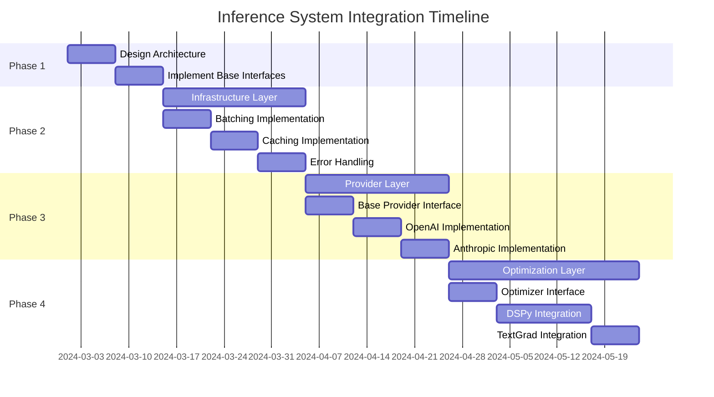

# Inference System Compatibility Plan

## Current Challenge
Multiple planned integrations (DSPy, TextGrad, LLM Inference Optimization) target the same inference system components, creating potential conflicts and incompatibilities. Each integration brings valuable benefits but modifies the same codebase areas.

## Business Impact
- **Without Coordination**: Integrations will conflict, creating maintenance burden and technical debt
- **With Coordinated Approach**: All integrations can co-exist, providing best-in-class inference capabilities
- **Value Proposition**: 30-50% improvement in prompt quality, reduced token usage, and improved performance

## Affected Components

| Integration | Files Modified | Implementation Approach | Key Features | Business Value |
|-------------|----------------|-------------------------|--------------|---------------|
| DSPy Integration | `inference/query_model.py`, DSPy modules | Structured I/O, optimizers | Better prompt design, reasoning | Higher quality research |
| TextGrad Integration | `inference/query_model.py`, TextGrad adapters | Gradient-based optimization | Continuous prompt improvement | More cost-efficient prompts |
| LLM Inference Optimization | `inference/query_model.py`, infrastructure modules | Better infrastructure | Batching, caching, error handling | Faster, more reliable inference |

## Unified Architecture Approach

### 1. Component Architecture Refactoring

The inference system will be refactored into a layered architecture:

```
┌──────────────────────────────────────────────────┐
│                Application Layer                 │
│     (Agent Interfaces, Research Workflows)       │
└───────────────────────┬──────────────────────────┘
                        │
┌──────────────────────▼──────────────────────────┐
│              Optimization Layer                 │
│ ┌─────────────┐  ┌──────────────┐  ┌──────────┐ │
│ │   DSPy      │  │   TextGrad   │  │  Custom  │ │
│ │ Integration │  │ Integration  │  │ Optimizers│ │
│ └─────────────┘  └──────────────┘  └──────────┘ │
└───────────────────────┬──────────────────────────┘
                        │
┌──────────────────────▼──────────────────────────┐
│             Infrastructure Layer                │
│ ┌─────────────┐  ┌──────────────┐  ┌──────────┐ │
│ │   Batching  │  │    Caching   │  │  Error   │ │
│ │             │  │              │  │ Handling  │ │
│ └─────────────┘  └──────────────┘  └──────────┘ │
└───────────────────────┬──────────────────────────┘
                        │
┌──────────────────────▼──────────────────────────┐
│               Provider Layer                    │
│ ┌─────────────┐  ┌──────────────┐  ┌──────────┐ │
│ │    OpenAI   │  │   Anthropic  │  │ DeepSeek │ │
│ │   Provider  │  │   Provider   │  │ Provider │ │
│ └─────────────┘  └──────────────┘  └──────────┘ │
└──────────────────────────────────────────────────┘
```

### 2. Detailed Implementation Plan

#### Phase 1: Abstraction Layer (2 weeks)
- **Tasks**:
  - Design and implement abstract interfaces for each layer
  - Define standard request/response formats between layers
  - Create plugin registration system for optimizers
  - Implement backward compatibility with existing query_model.py
  
- **Files**:
  - `inference/layers/base.py` (~150 LOC) - Abstract base classes
  - `inference/plugin.py` (~100 LOC) - Plugin system for extensibility
  
- **Success Metrics**:
  - 100% backward compatibility with existing code
  - Well-defined interfaces with comprehensive tests
  - Plugin system capable of registering/unregistering components

#### Phase 2: Infrastructure Layer (3 weeks)
- **Tasks**:
  - Implement batching system for similar requests
  - Create multi-level caching (memory, disk, semantic)
  - Develop robust error handling with retries and fallbacks
  - Add telemetry for performance monitoring
  - Build configuration system for infrastructure options
  
- **Files**:
  - `inference/layers/infrastructure/batch.py` (~150 LOC) - Request batching
  - `inference/layers/infrastructure/cache.py` (~200 LOC) - Caching system
  - `inference/layers/infrastructure/errors.py` (~150 LOC) - Error handling
  - `inference/layers/infrastructure/telemetry.py` (~100 LOC) - Performance tracking
  
- **Success Metrics**:
  - 30%+ reduction in duplicate API calls
  - 50%+ improved handling of rate limit errors
  - Configurable batching with measurable performance gains

#### Phase 3: Provider Layer (3 weeks)
- **Tasks**:
  - Implement unified model provider interface
  - Create adapter implementations for each provider
  - Add provider-specific optimizations
  - Implement unified token counting
  - Build provider selection and fallback logic
  
- **Files**:
  - `inference/layers/providers/base.py` (~100 LOC) - Provider interface
  - Provider-specific implementations (~100 LOC each)
  - `inference/layers/providers/factory.py` (~80 LOC) - Provider factory
  
- **Success Metrics**:
  - Support for at least 3 model providers
  - Consistent behavior across providers
  - Provider-agnostic token counting

#### Phase 4: Optimization Layer (4 weeks)
- **Tasks**:
  - Implement DSPy integration
  - Integrate TextGrad capabilities
  - Create optimization pipeline
  - Implement A/B testing framework for optimizers
  - Build optimizer composition system
  
- **Files**:
  - `inference/layers/optimizers/base.py` (~100 LOC) - Optimizer interface
  - `inference/layers/optimizers/dspy.py` (~200 LOC) - DSPy integration
  - `inference/layers/optimizers/textgrad.py` (~200 LOC) - TextGrad integration
  - `inference/layers/optimizers/pipeline.py` (~150 LOC) - Pipeline orchestration
  
- **Success Metrics**:
  - 20%+ improvement in prompt effectiveness
  - 15%+ reduction in token usage
  - Ability to compose multiple optimizers

### 3. Feature Toggle System

To manage the complexity of multiple integrations, a feature toggle system will be implemented:

```python
class InferenceConfig:
    """Configuration for inference system."""
    
    def __init__(self):
        # Infrastructure layer toggles
        self.enable_batching = True
        self.enable_caching = True
        self.cache_ttl_seconds = 3600
        
        # Provider layer toggles
        self.default_provider = "openai"
        self.fallback_providers = ["anthropic", "deepseek"]
        
        # Optimization layer toggles
        self.enable_dspy = True
        self.enable_textgrad = True
        self.optimization_level = 2  # 0=none, 1=basic, 2=advanced
```

### 4. Integration Timeline and Dependencies



### 5. Key Technical Challenges and Solutions

| Challenge | Solution Approach | Technical Implementation |
|-----------|-------------------|--------------------------|
| Differing optimization techniques | Composable optimization pipeline | Chain of responsibility pattern |
| Provider-specific features | Capability detection and adaptation | Provider capability registry |
| Maintaining backward compatibility | Legacy adapter | Adapter pattern for old query_model.py |
| Performance overhead of layering | Lightweight interfaces, caching | Strategic caching, lazy loading |
| Thread safety | Thread-local storage | Contextvars for request context |

## Testing and Validation

### Unit Testing (80+ tests)
- Abstract interface contracts
- Provider implementations
- Optimizer functionality
- Infrastructure components

### Integration Testing (30+ tests)
- End-to-end inference flows
- Layer interaction tests
- Configuration validation
- Error case handling

### Performance Benchmarking
- Latency measurements
- Throughput (requests/second)
- Token usage efficiency
- Memory consumption

## Deployment and Rollout Strategy

1. **Phased Deployment**:
   - Deploy infrastructure layer first
   - Add providers incrementally
   - Enable optimizers gradually with feature flags

2. **Monitoring and Observability**:
   - Track key performance indicators
   - Monitor error rates and latencies
   - Collect optimizer effectiveness metrics

3. **Rollback Procedures**:
   - Feature flag mechanism for quick disabling
   - Version pinning for dependencies
   - Dual-running capability during transition

## Resource Requirements

- **Engineering**: 1-2 dedicated developers
- **Testing**: 1 QA engineer (part time)
- **Infrastructure**: CI/CD pipeline updates
- **Dependencies**: DSPy, TextGrad, caching libraries

## Minimal Implementation Option

If full implementation is too resource-intensive, a simplified version would:

1. Create lightweight provider abstraction layer
2. Implement basic infrastructure improvements
3. Add plugin system for optimizers
4. Maintain the existing query_model.py interface

This would enable integration of different components while postponing the full layered architecture.