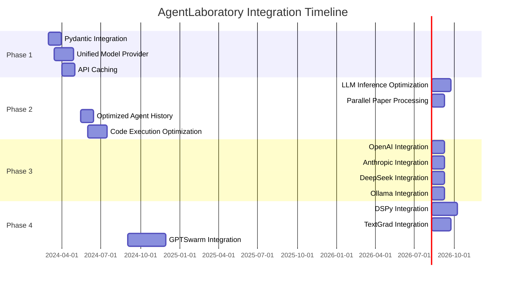

# AgentLaboratory Integration Prioritization Roadmap

## Overview
This document outlines the prioritization and sequencing of integration efforts for AgentLaboratory, ensuring coherent architecture evolution and minimizing compatibility issues while maximizing research value.

## Guiding Principles
1. **Minimize Architectural Changes**: Prioritize integrations that extend rather than replace existing architecture
2. **Build Foundation First**: Core infrastructure improvements before specialized integrations
3. **Balance Quick Wins vs Long-term Benefits**: Mix short-term improvements with strategic enhancements
4. **Maintain Backward Compatibility**: Ensure existing workflows continue to function throughout the process
5. **Focus on Research Value**: Prioritize changes that directly improve research capabilities and user experience

## Integration Roadmap

### Phase 1: Core Infrastructure (Months 1-2)
| Integration | Complexity | Priority | Dependencies | Value Proposition | Resource Req. |
|-------------|------------|----------|--------------|-------------------|---------------|
| Pydantic Integration | Medium | High | None | Data validation, better error handling | 1 developer |
| Unified Model Provider | High | High | None | Model interoperability, simplified maintenance | 1-2 developers |
| API Caching | Medium | High | None | 50%+ reduction in API calls, faster research | 1 developer |

**Expected Outcomes**:
- Reduced bugs from invalid data structures
- Simplified model provider integration
- Faster literature review phase
- Reduced external API costs

**Success Metrics**:
- 90%+ test coverage for data structures
- Support for at least 3 model providers
- 50%+ reduction in duplicate API calls

### Phase 2: Performance Optimization (Months 3-4)
| Integration | Complexity | Priority | Dependencies | Value Proposition | Resource Req. |
|-------------|------------|----------|--------------|-------------------|---------------|
| LLM Inference Optimization | High | High | Unified Model Provider | 30%+ reduction in token usage, faster responses | 1-2 developers |
| Parallel Paper Processing | Medium | Medium | API Caching | 70%+ faster literature review | 1 developer |
| Optimized Agent History | Medium | Medium | None | 30%+ reduced memory usage | 1 developer |
| Code Execution Optimization | High | Medium | None | 40%+ faster experiment execution | 1 developer |

**Expected Outcomes**:
- Significantly faster end-to-end research cycles
- Reduced token usage and associated costs
- Improved resource utilization
- More efficient experiment execution

**Success Metrics**:
- 50%+ overall performance improvement
- 30%+ reduction in token consumption
- Successful handling of 2x larger research datasets

### Phase 3: Model Providers (Months 5-6)
| Integration | Complexity | Priority | Dependencies | Value Proposition | Resource Req. |
|-------------|------------|----------|--------------|-------------------|---------------|
| OpenAI Integration | Medium | High | Unified Model Provider | Support for GPT models | 1 developer |
| Anthropic Integration | Medium | High | Unified Model Provider | Support for Claude models | 1 developer |
| DeepSeek Integration | Medium | Medium | Unified Model Provider | Support for DeepSeek models | 1 developer |
| Ollama Integration | Medium | Medium | Unified Model Provider | Local model deployment | 1 developer |

**Expected Outcomes**:
- Broad model support across vendors
- Flexibility to choose optimal models for research tasks
- Support for both cloud and local deployment
- Vendor independence

**Success Metrics**:
- Successful integration of all targeted providers
- Equivalent functionality across providers
- Ability to switch providers without code changes

### Phase 4: Advanced Capabilities (Months 7-10)
| Integration | Complexity | Priority | Dependencies | Value Proposition | Resource Req. |
|-------------|------------|----------|--------------|-------------------|---------------|
| DSPy Integration | High | High | Unified Model Provider | Improved prompt engineering, higher accuracy | 2 developers |
| TextGrad Integration | High | Medium | Unified Model Provider, DSPy Integration | Optimized prompts, lower token usage | 1-2 developers |
| GPTSwarm Integration | Very High | Low | All Model Providers | Complex multi-agent research workflows | 2-3 developers |

**Expected Outcomes**:
- Higher quality research outputs
- More sophisticated agent interactions
- Enhanced prompt engineering capabilities
- Ability to tackle more complex research problems

**Success Metrics**:
- 30%+ improvement in research output quality
- Successful implementation of multi-agent collaborations
- Demonstrated ability to handle complex, novel research tasks

## Critical Path Dependencies and Timeline

## Resource Allocation
- **Core Team**: 2-3 full-time developers
- **Phase Transitions**: 2-week testing and stabilization periods
- **Critical Paths**: Unified Model Provider and DSPy Integration require most attention
- **External Dependencies**: Model provider APIs, third-party libraries

## Risk Assessment and Mitigation

| Risk | Likelihood | Impact | Mitigation Strategy |
|------|------------|--------|---------------------|
| API changes in model providers | High | Medium | Abstract interfaces, provider-specific adapters |
| Integration conflicts | Medium | High | Clear boundaries, comprehensive tests, feature flags |
| Performance regressions | Medium | High | Baseline metrics, performance gates in CI/CD |
| Resource constraints | High | Medium | Minimal implementations, prioritize high-value features |
| Technical debt | Medium | Medium | Code reviews, refactoring phases between integrations |

## Compatibility Monitoring Strategy
1. **Common Interface Approach**: 
   - Implement model-agnostic interfaces
   - Use dependency injection for provider-specific features
   - Define clear abstract classes for all integration points

2. **Integration Validation Checkpoints**:
   - Each phase requires end-to-end validation testing
   - Integration tests for multi-component interaction
   - Performance benchmarks to ensure no regressions

3. **Fallback Mechanisms**:
   - Implement graceful degradation paths
   - Provide compatibility layers where needed
   - Ensure core functionality works if advanced features fail

## Evaluation and Adjustment Process
- Bi-weekly integration status reviews
- End-of-phase retrospectives to evaluate outcomes
- Adjustment of priorities based on user feedback and research needs
- Documentation of integration learnings and best practices