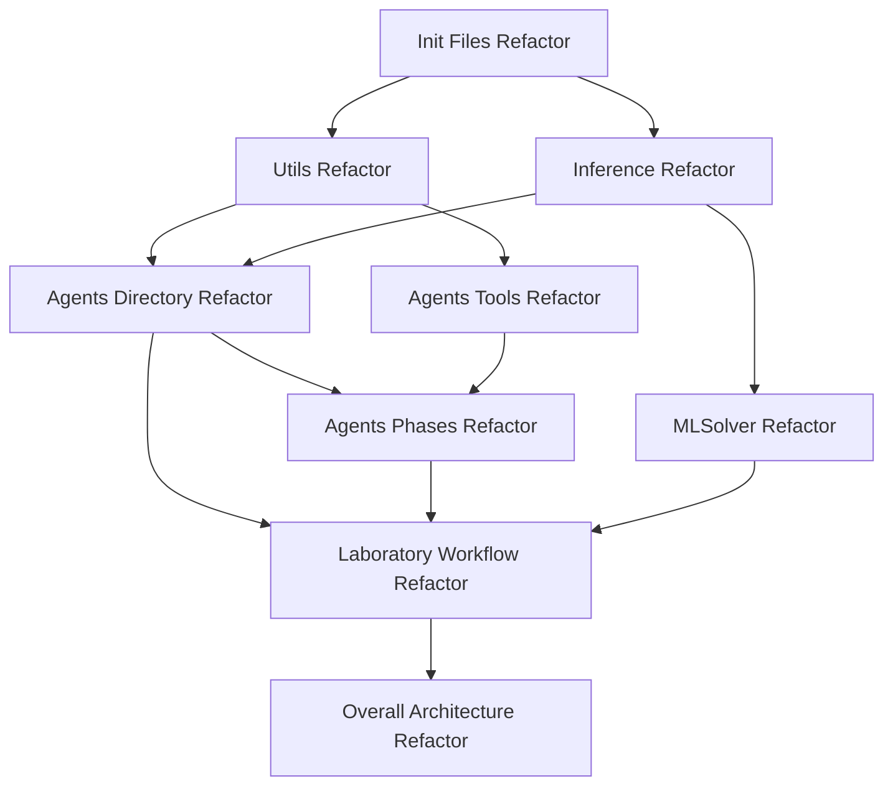

# AgentLaboratory Refactoring Dependency Map

## Overview
This document outlines the dependencies and prioritization between various refactoring efforts in the AgentLaboratory project. It provides a clear sequence for implementing refactors to minimize conflicts and maximize cohesion.

## Dependency Graph

## Prioritization Matrix

| Refactor Name | Complexity | Priority | Timeline | Dependencies | Value/Effort Ratio |
|---------------|------------|----------|----------|--------------|-------------------|
| Init Files    | Low        | High     | 1 week   | None         | High              |
| Utils         | Medium     | High     | 2 weeks  | Init Files   | High              |
| Inference     | High       | High     | 4 weeks  | Init Files   | Medium            |
| Agents Directory | Medium  | Medium   | 3 weeks  | Utils, Inference | Medium        |
| MLSolver      | High       | Medium   | 3 weeks  | Inference    | Medium            |
| Agents Tools  | Medium     | Medium   | 2 weeks  | Utils        | Medium            |
| Agents Phases | High       | Medium   | 3 weeks  | Agents Directory, Agents Tools | Medium |
| Laboratory Workflow | Very High | Low | 6 weeks | Agents Directory, Agents Phases, MLSolver | Low |
| Overall Architecture | Very High | Low | 8+ weeks | All others | Low |

## Implementation Waves

### Wave 1: Foundation (Weeks 1-3)
- **Init Files Refactor** (Week 1)
  - Standardize module exports
  - Improve package structure
  - Enable proper imports

- **Utils Refactor** (Weeks 2-3)
  - Standardize utility functions
  - Improve error handling
  - Add comprehensive documentation

### Wave 2: Core Components (Weeks 4-7)
- **Inference Refactor** (Weeks 4-7)
  - Create unified provider interface
  - Implement layered architecture
  - Improve error handling and recovery

- **Agents Tools Refactor** (Weeks 5-6)
  - Create abstracted tool interfaces
  - Standardize error handling
  - Implement plugin system

### Wave 3: Agent Framework (Weeks 8-13)
- **Agents Directory Refactor** (Weeks 8-10)
  - Create consistent agent interfaces
  - Implement agent registry
  - Standardize agent messaging

- **MLSolver Refactor** (Weeks 8-10)
  - Streamline problem-solving interfaces
  - Add extensibility points
  - Improve error reporting

- **Agents Phases Refactor** (Weeks 11-13)
  - Create standard phase execution model
  - Implement phase registry
  - Add monitoring and telemetry

### Wave 4: Workflow Integration (Weeks 14-19)
- **Laboratory Workflow Refactor** (Weeks 14-19)
  - Create workflow orchestration system
  - Implement event-driven architecture
  - Add configuration management
  - Improve state persistence

### Wave 5: Architecture Evolution (Weeks 20+)
- **Overall Architecture Refactor** (Weeks 20+)
  - Implement plugin framework
  - Create web-based visualization
  - Add distributed execution
  - Implement marketplace for workflows

## Critical Path Components

The following components are on the critical path and should be prioritized:
1. **Init Files Refactor**: Foundational for all other refactors
2. **Inference Refactor**: Central to model interactions and critical for performance
3. **Agents Directory Refactor**: Core agent abstractions that many other components depend on

## Risk Assessment

| Refactor | Key Risks | Mitigation Strategies |
|----------|-----------|----------------------|
| Init Files | Breaks imports in many files | Comprehensive test coverage, staged deployment |
| Inference | Performance regression, API changes | Benchmarking, compatibility layer |
| Utils | Function signature changes affect many consumers | Deprecation warnings, thorough testing |
| Agents Directory | Breaks existing agent implementations | Clear interfaces, migration guides |
| MLSolver | Compatibility with existing solvers | Adapter pattern, comprehensive testing |
| Agents Tools | External API dependencies change | Robust error handling, fallback mechanisms |
| Agents Phases | Research workflow disruption | Thorough validation, phased rollout |
| Laboratory Workflow | Too ambitious, scope creep | Focus on core functionality first, clear milestones |
| Overall Architecture | Resource intensive, long timeline | Modular approach, prioritize high-value components |

## Measuring Success

Each refactoring effort should be evaluated against these metrics:
- Code maintainability improvement (static analysis scores)
- Test coverage increase
- Performance impact (neutral or positive)
- Developer experience improvement (qualitative)
- Reduction in technical debt (fewer TODOs, deprecated methods)

## Interdependency Management

To manage overlapping changes between refactors:
1. Create feature branches for each refactor
2. Implement comprehensive CI/CD to catch integration issues
3. Schedule regular integration points between related refactors
4. Maintain thorough documentation of API changes
5. Create clear ownership and communication channels for each refactor

## Minimal Viable Refactoring Plan

If resource constraints limit the full refactoring effort, focus on:
1. Init Files Refactor
2. Inference Refactor (core functionality only)
3. Agents Directory Refactor (interface standardization)

These three refactors provide the highest value for the lowest effort and address the most critical architecture issues.